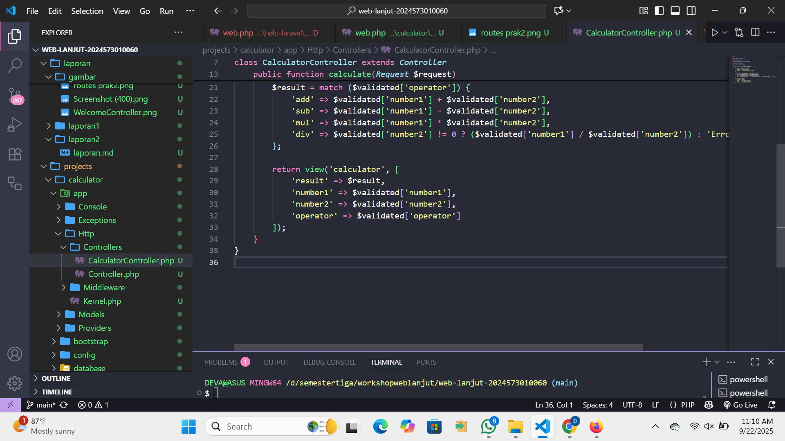

# Laporan Modul 2: Laravel Fundamentasl
**Mata Kuliah:** Workshop Web Lanjut   
**Nama:** Deva Risny 
**NIM:** 2024573010060  
**Kelas:** TI-2C

---

## Abstrak 

Laporan ini membahas tentang penerapan konsep dasar Laravel, terutama  bagian penggunaan Route, Controller, dan View yang merupakan bagian dari MVC dalam membuat aplikasi web sederhana. Tujuan laporan ini adalah untuk memahami bagaimana alur kerja Laravel dalam menangani request dan response, serta mempraktikkan pembuatan aplikasi sederhana yaitu kalkulator. Dengan praktikum ini, diharapkan untuk dapat mengerti cara kerja MVC di Laravel, peran routing, fungsi middleware, serta penggunaan Blade sebagai templating engine.

---

## 1. Dasar Teori

- Apa itu MVC (Model, View, Controller).
Model View Controller atau yang dapat disingkat MVC adalah sebuah pola arsitektur dalam membuat sebuah aplikasi dengan cara memisahkan kode menjadi tiga bagian yang terdiri dari:

Model
 Bagian yang bertugas untuk menyiapkan, mengatur, memanipulasi, dan mengorganisasikan data yang ada di database.

View
Bagian yang bertugas untuk menampilkan informasi dalam bentuk Graphical User Interface (GUI).

Controller
Bagian yang bertugas untuk menghubungkan serta mengatur model dan view agar dapat saling terhubung.

- Konsep Routing di Laravel.
Routing di Laravel mendefinisikan bagaimana aplikasi merespons permintaan (request) yang masuk. Routing menghubungkan URI ke aksi controller atau closure. Route di Laravel didefinisikan di file routes/web.php untuk permintaan web dan di routes/api.php untuk route API.

- Fungsi Middleware.
Middleware menjadi salah satu fitur yang sangat penting pada Laravel. Dengan Middleware kita dapat mengontrol dan memodifikasi permintaan HTTP setelah ataupun sebelum permintaan tersebut diproses oleh aplikasi Laravel kita. Middleware pada Laravel layaknya seperti filter sebagai penghubung antara permintaan HTTP dengan aplikasi Laravel kita yang dapat membantu memeriksa permintaan dan menentukan apa yang harus dilakukan sebelum permintaan tersebut diproses.

- Bagaimana cara Laravel menangani Request dan Response.
Cara Laravel mengangani Reguest dan Response User mengirim Request, 
1. User mengakses aplikasi lewat browser, Request dikirim ke sarver (Laravel)
2. Semua Request masuk ke  file Front Controller (public/index.php). File akan  bootstrap menghidupkan aplikasi Laravel dan mengirim request ke HTTP Kernel
3. HTTP Kernel adalah otak utama yang mengatur Request, Kernel menjalankan Middleware global, Middleware bisa mengubah request sebelum di teruskan ke route controller
4. Route mencocokkan URI (calculator) dengan definisi di routes/web.php. Laravel akan tau menjalankan controller method (CalculatorController).
5. Controller/Closure menerima request, memproses logika (query database, perhitungan) hasilnya biasa berupa data, tampilan , atau JSON.
6. Controller mengembalikan response ke Laravel. View ke HTML ( return view('calculator')) Redirect ke arahkan ke halaman lain JSON ke untuk API Plain text
7. Middleware (setelah Response) dibuat contohnya menambahkan header dan keamanan.
8. Response Dikirim ke Client, Laravel mengirim response HTML,JSON,teks ke browser user. Browser menampilkan hasilnya di layar.

- Peran Controller dan View.
Controller
Controller bertugas sebagai penghubung antara Model dan View. Controller mendapatkan input dari pengguna melalui HTTP Request, lalu memproses input yang diterima dengan berinteraksi dengan Model. Terakhir mengembalikan hasilnya pada View untuk ditampilkan ke pengguna. Arsitektur MVC memisahkan antara logika, tampilan, serta kontroler membuat mudah dalam pemeliharaan dan pengembangan aplikasi secara menyeluruh.

View
View bertugas sebagai tampilan website atau aplikasi. Data yang ditampilkan oleh view bisa berupa HTML, JSON, XML.
Letak path directory view ada di “resources/views”. Di Laravel pembuatan view menggunakan blade templating engine. File view ditulis dengan format namafile.blade.php

- Fungsi Blade Templating Engine.
Blade Templating Engine membawa kemudahan, kejelasan, dan kecepatan ke dunia pengembangan web. Dengan sintaks yang sederhana dan ekspresif, serta integrasi yang mulus dengan framework Laravel, Blade memungkinkan pengembang untuk menciptakan tata letak halaman web yang kompleks dengan mudah. Dengan memilih Blade, pengembang dapat meningkatkan efisiensi pengembangan, membuat fokus pada logika aplikasi yang lebih kompleks dan inovatif. Sebagai alat templating yang tangguh dan efisien, Blade Templating Engine tetap menjadi pilihan utama bagi pengembang web yang mencari solusi templating yang handal dan efektif.

---

## 2. Langkah-Langkah Praktikum

2.1 Praktikum 1 – Route, Controller, dan Blade View

- Tambahkan route pada routes/web.php.
Menambahkan route baru yang akan memanggil controller. Route ini berfungsi untuk menghubungkan URL dengan fungsi yang ada pada controller.

- Buat controller WelcomeController.
Buat controller dengan perintah artisan di terminal : php artisan make: controller WelcomeController

- Buat view mywelcome.blade.php.
View untuk menampilkan tampilan ke pengguna. Buat file baru di folder resources/views/mywelcome.blade.php

- Jalankan aplikasi dan tunjukkan hasil di browser.  Jalankan server dengan perintah: php artisan serve

 Hasil:

2.2 Praktikum 2 – Membuat Aplikasi Sederhana "Calculator"

- Tambahkan route untuk kalkulator.
 Buka file routes/web.php lalu tambahkan kode seperti di gambar:

- Buat controller CalculatorController.
 Jalankan perintah artisan di terminal: php artisan make: controller CalculatorController.Lalu buka file app/Http/Controllers/CalculatorController.php dan isi dengan:

- Tambahkan view calculator.blade.php.
 Buat file di resources/views/calculator.blade.php:

- Jalankan aplikasi dengan beberapa input berbeda. 
Jalankan server dengan perintah: php artisan serve

Screenshot Hasil:

---

## 3. Hasil dan Pembahasan

- Dari praktikum yang telah dilakukan, aplikasi kalkulator berhasil dibuat dan dapat berjalan sesuai dengan yang diharapkan. Ketika kita memasukkan angka pertama, angka kedua, serta memilih operator (penjumlahan, pengurangan, perkalian, pembagian), aplikasi dapat menampilkan hasil perhitungan dengan benar.

- jika ada input yang salah (misalnya pembagian dengan 0)Laravel akan menghentikan perhitungan dan menampilkan pesan error sesuai dengan validasi yang sudah ditentukan. 

- Validasi input di Laravel bekerja dengan cara memeriksa data yang dikirim melalui form/request sebelum diproses oleh Controller. Kita bisa menambahkan aturan validasi (rules) di Controller menggunakan method validate(). Jika data tidak sesuai aturan, Laravel otomatis mengembalikan pesan error tanpa menjalankan proses selanjutnya.

- Peran masing-masing komponen dalam program ini:
Route bertugas menghubungkan URL dengan controller.
Controller berfungsi memproses logika, seperti menghitung angka.
View menampilkan hasil perhitungan ke pengguna dalam bentuk halaman web.
Dengan ini, aplikasi lebih mudah dipahami, dikelola, dan dikembangkan.

---

## 4. Kesimpulan

Dari praktikum ini dapat disimpulkan bahwa Laravel memudahkan kita dalam membuat aplikasi web dengan MVC. Dengan adanya Route, Controller, dan View, kode jadi lebih rapi karena setiap bagian punya fungsi masing-masing. Validasi input yang disediakan Laravel juga membantu mencegah error pada saat perhitungan.

Secara keseluruhan, praktikum ini membuat kita lebih paham bagaimana request dari pengguna diproses oleh Laravel hingga akhirnya menghasilkan response yang ditampilkan di browser. Aplikasi kalkulator sederhana ini menjadi contoh  bagaimana konsep MVC, routing, dan Blade templating engine dapat diterapkan dalam pengembangan web.

---

## 5. Referensi

1. Apa itu MVC https://www.dicoding.com/blog/apa-itu-mvc-pahami-konsepnya/
2. Fungsi Middleware https://buildwithangga.com/tips/fungsi-utama-middleware-pada-laravel
3. Peran Controller dan View https://www.rumahweb.com/journal/belajar-laravel-bagian-3/
4. Fungsi Blade Templating Engine https://baraka.uma.ac.id/blade-templating-engine-mengoptimalkan-pengembangan-web-dengan-efisien/
---