# Laporan Modul 3: Laravel Controller
*Mata Kuliah:* Workshop Web Lanjut   
*Nama:* Deva Risny
*NIM:* 2024573010060
*Kelas:* TI-2C  

---
## Abstrak 
Pada praktikum ini, mahasiswa belajar tentang penggunaan Controller di Laravel, yaitu bagian dari framework yang berfungsi untuk mengatur alur logika antara route, model, dan view. Dengan menggunakan controller, kode program menjadi lebih teratur, mudah dikelola, dan tidak bercampur dengan tampilan. Dalam percobaan ini dilakukan tiga latihan, yaitu membuat controller untuk menampilkan view, menggunakan group route, dan menerapkan prefix dengan namespace. Hasilnya, mahasiswa dapat memahami bagaimana controller mengatur proses request dan response di Laravel.

---

## 1. Dasar Teori
Apa itu Controller? 
Controller adalah komponen dalam framework Laravel yang bertanggung jawab untuk menangani logika aplikasi. Ia berfungsi sebagai "jembatan" antara routing dan bagian lain dari aplikasi, seperti model dan view. Dengan menggunakan controller, Anda dapat memisahkan logika aplikasi dari kode yang digunakan untuk menangani tampilan (view), sehingga struktur kode lebih rapi, mudah dikelola, dan bersifat modular.

Jenis-Jenis Controller(Pada Laravel)
 1. Basic Controllers (Controller Dasar)
 2. Basic Controllers (Controller Dasar)
 3. Basic Controllers (Controller Dasar)
 4. Pengelompokan Rute dengan Controller
 5. Injeksi Permintaan dan Injeksi Ketergantungan
 6. Validasi Permintaan dalam Controller
 7. Mengembalikan Respons dari Controller
 Controller dapat mengembalikan berbagai jenis respons:
 - View
 - JSON
 - Redirect
 - Respons Kustom

---

## 2. Langkah-Langkah Praktikum
Tuliskan langkah-langkah yang sudah dilakukan, sertakan potongan kode dan screenshot hasil.

2.1 Praktikum 1 – Menangani Request dan Response View di Laravel 12

1. Buat proyek laravel baru dengan nama lab-view
dengan perintah "composer create-project laravel/laravel:^12.0.3 lab-view" kemudian masuk ke proyek tersebut dengan perintah cd lab-view

2. Buat  Controller dengan nama DemoController di di terminal dengan perintah "php artisan make:controller DemoController".  Bukaapp/Http/Controllers/DemoController.php . Edit :
 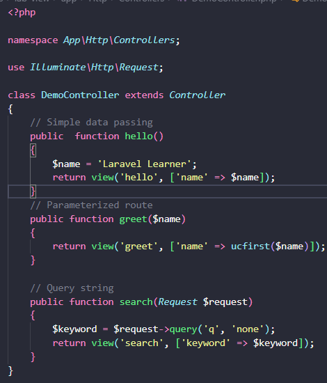

3. Definisikan Rut. Edit routes/web.php
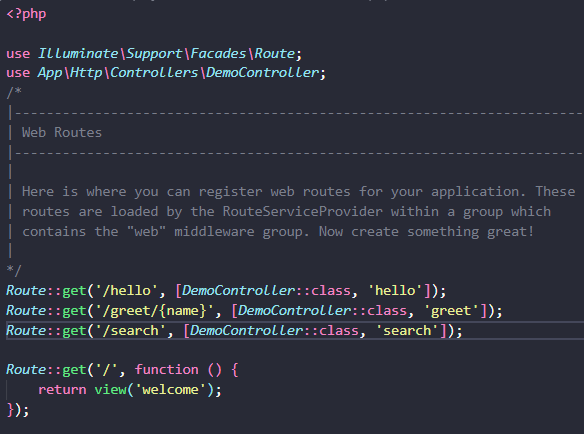

file berikut didalam resources/views/

- hello.blade.php

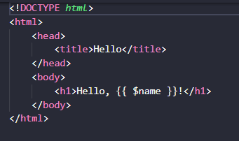

- greet.blade.php

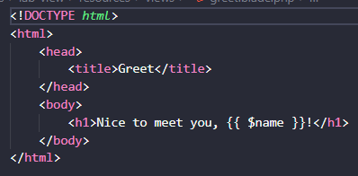

- search.blade.php

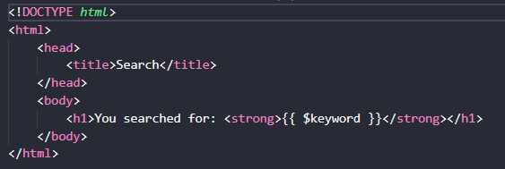

5. jalankan serve dengan perintah: php artisan serve
- Meneruskan data ke view http://127.0.0.1:8000/hello
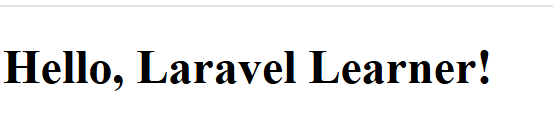

- Rute berparameter http://127.0.0.1:8000/greet/Deva

- Query string http://127.0.0.1:8000/search?q=laravel
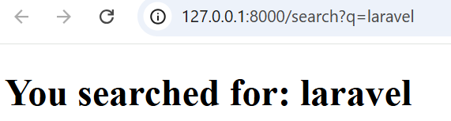

4. Buat view sederhana. Buatlah
- Tambahkan route pada routes/web.php.
    Editkan di routes/web.php menjadi seperti pada gambar berikut.
     dan itu mengarah ke Demo controller , kemudian buat controller nya(DemoController).

- Buat controller DemoController.php
    Create DemoController pada GitBash yang ada pada vscode lalu ketikkan sesuai dengan gambar berikut

    

- Buat view sederhana pada resources/views.
   buat file blade ini pada resources/views:
- hello.blade.php
Buatlah code nya seperti berikut: 

    

- greet.blade.php
 Buatlah code nya seperti berikut:

    

        - search.blade.php
        Buatlah code nya seperti berikut:
        
    

5. Jalankan aplikasi dan tunjukkan hasil di browser.
    http://127.0.0.1:8000/hello
      Tampilan Browser 
    http://127.0.0.1:8000/greet/Bunga (Pada url ini bebas tergantung codingannya yang anda inputkan.)
      Tampilan Browser 
    http://127.0.0.1:8000/search?q=laravel
      Tampilan Browser 

2.2 Praktikum 2 – Menggunakan grouproute

1. Buat proyek Laravel lab-group dengan perintah di terminal "composer create-project laravel/laravel:^12.0.3 lab-group"  masuk ke proyeknya cd lab-group

2. Buat Controller dengan perintah "php artisan make:controller PageController"
Edit controller di app/Http/Controllers/PageController.php
 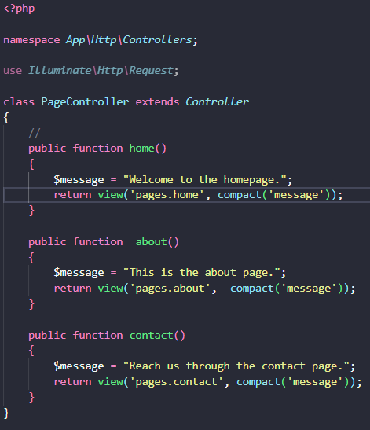

4. Buat view sederhana
buat folder pages didalam resources/views/. kemudian buat file:
- home.blade.php

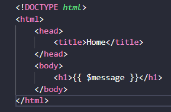

- about.blade.php

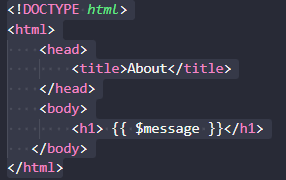

- contact.bllade.php

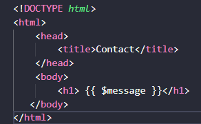

5. jalankan serve  dengan perintah: php artisan serve
- Home
http://127.0.0.1:8000/
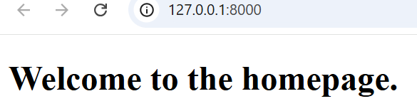
- About
http://127.0.0.1:8000/about  
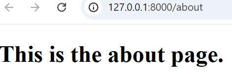
- Contact
http://127.0.0.1:8000/contact 

5. Buat view sederhana. buat folder admin di dalam resources/views/. Lalu buat file:
- dashboard.blade.php
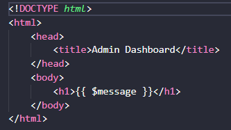

    buat folder users/ . didalam admin

- di dalamnya buat file index.blade.php. untuk menampilkan daftar pengguna
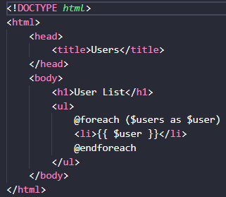

- buat juga file show.blade.php

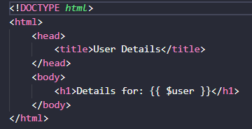

6. jalan kan serve: php artisan serve

- dashboard
    http://127.0.0.1:8000/admin/dashboard
    Output: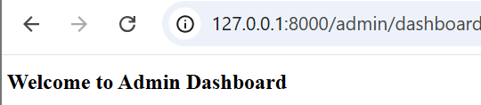

-  users
    http://127.0.0.1:8000/admin/users
     Output: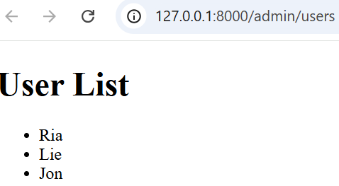
    
 - Detail pengguna
    http://127.0.0.1:8000/admin/users/2
      Output:!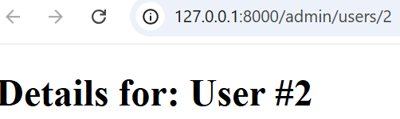
    

---
## 3. Hasil dan Pembahasan
- Pada Praktikum 1
Controller digunakan untuk menangani request dan mengirim data ke view.

- Pada Praktikum 2
Penggunaan group route mempermudah pengorganisasian halaman.

- Pada Praktikum 3
Prefix dan namespace memudahkan pengelompokan route untuk area seperti admin panel.

---

## 4. Kesimpulan
Dari hasil praktikum, dapat disimpulkan bahwa penggunaan controller di Laravel membuat proses pengembangan aplikasi menjadi lebih mudah. Controller membantu memisahkan logika aplikasi dari tampilan, sehingga mempermudah perawatan dan pengembangan di masa depan. Selain itu, fitur seperti group route dan prefix juga memudahkan pengaturan halaman-halaman dalam aplikasi.

---

## 5. Referensi
- https://buildwithangga.com/tips/apa-itu-controller-pada-laravel
- https://hackmd.io/@mohdrzu/H1sB73dnxg
---