# Laporan Modul 4: Laravel Blade Template Engine
*Mata Kuliah:* Workshop Web Lanjut   
*Nama:* Deva Risny
*NIM:* 2024573010060
*Kelas:* TI-2C  

---

## Abstrak 
- Modul ini membahas penerapan Blade Template Engine dan Controller pada  framework Laravel 12 mmelalui  serangkaian pratikum. Pratikum ini dilakukan meliputi pengiriman data dari controller ke view, penggunaan struktur logika dalam Blade, serta pembuatan layout dengan bantuan Bootstrap.
Melalaui pratikum ini, mempelajari bagaimana mengatur logika aplikasi di controller dan menampilkan data secara dinamis di tampilan view menggunakan Blade, sehingga pengembangan web menjadi lebih terstruktur dan efisien.

---

## 1. Dasar Teori
1.1 Pengertian Controller
Controller bertugas sebagai penghubung antara Model dan View. Controller mendapatkan input dari pengguna melalui HTTP Request, lalu memproses input yang diterima dengan berinteraksi dengan Model. Terakhir mengembalikan hasilnya pada View untuk ditampilkan ke pengguna. Arsitektur MVC memisahkan antara logika, tampilan, serta kontroler membuat mudah dalam pemeliharaan dan pengembangan aplikasi secara menyeluruh.
Controller biasanya digunakan untuk mengatur logika bisnis agar kode lebih terstruktur dan mudah dikelola.

1.2 Pengertian Blade
    Blade adalah mesin templating Laravel yang ringan, tapi tetap kuat. Blade memungkinkan pengembang untuk menggunakan sintaks sederhana untuk membuat tampilan dinamis dan dapat digunakan kembali. Jadi kita tidak perlu menulis kode berulang kali untuk membuat sebuah tampilan yang berulang seperti header, navbar, dan footer.

1.3 Konsep Layout dan Komponen
    Dalam Laravel, layout digunakan untuk mengatur kerangka dasar halaman sehingga kode yang berulang, seperti header, footer, dan navigasi, tidak perlu ditulis berulang kali di setiap file View. Layout disimpan dalam folder resources/viewsdan biasanya menggunakan file Blade.

komponen dalam Laravel Blade adalah potongan kode tampilan view  bersifat modular dan dapat digunakan kembali. Komponen biasanya berisi bagian UI yang sama di banyak halaman, seperti kartu, tombol, navigasi, atau footer.
    Dengan menggunakan komponen, kode HTML menjadi lebih rapi dan mudah dikelola karena setiap elemen yang berulang disimpan dalam satu file terpisah dan bisa dipanggil di berbagai view menggunakan sintaksnya sendiri

Templat parsial adalah salah satu fitur Laravel yang dirancang untuk membantu pengembang menjaga kebersihan kode, meningkatkan efisiensi , dan meningkatkan keterbacaan 

---

## 2. Langkah-Langkah Praktikum

2.1 Praktikum 1 – Meneruskan Data dari Controller ke Blade View

  1. Membuat project laravel baru     menggunakan perintah "Laravel new modul-4-blade-view" kemudian masuk ke direktori project dengan perintah "cd modul-4-blade-view". 

  2. Buat Controller untuk menangani route dan logika, dengan perintah php artisan make:controller DasarBladeController.

  3. Tambahkan route pada routes/web.php.
    Editkan di routes/web.php menjadi seperti pada gambar berikut.
    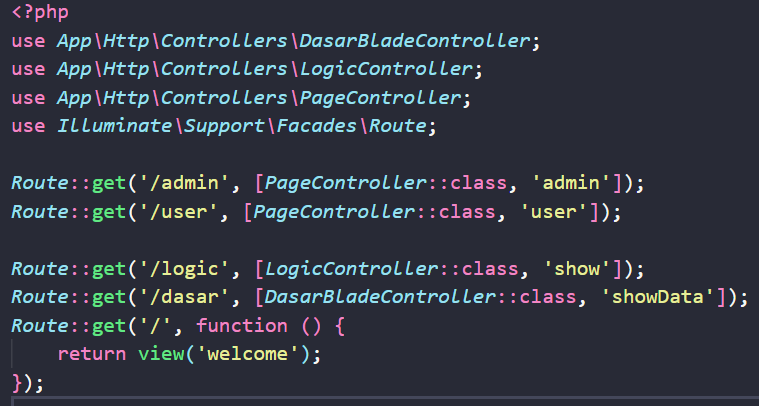 

  4. Buat Metode untuk menghandle data pada Controller
  Buka app/Http/Controllers/DasarBladeController.php dan tambahkan metode berikut:
  

  5.  Buat Blade View
  Buat file baru di resources/views/dasar.blade.php:
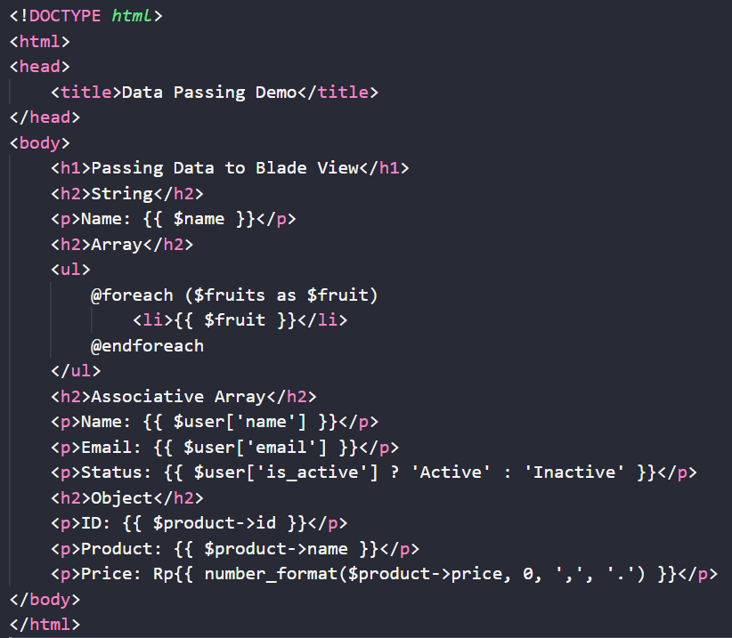

  6. Menjalankan aplikasi dan menampilkan hasil di browser.
    http://127.0.0.1:8000/dasar
    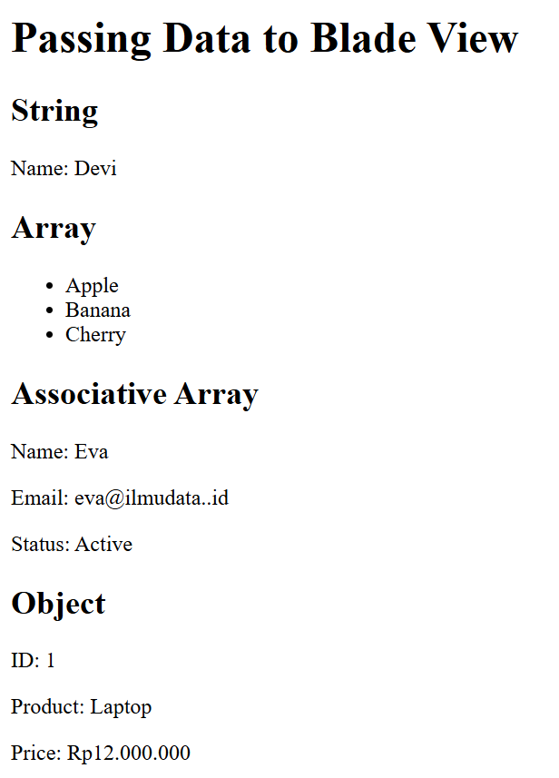

2.2 Praktikum 2 – Menggunakan Struktur Kontrol Blade

1.  Buat Controller baru
    Di dalam project modul-4-blade-view buatlah sebuah controller baru: php artisan make:controller LogicController
    Ini membuat app/Http/Controllers/LogicController.php

2. Tambahkan route baru dalam web.php.
    Editkan di routes/web.php menjadi seperti pada gambar berikut.
    
    
3.  Tambahkan Logika di Controller.
    Sekarang kita akan menambahkan logika ke metode show. Edit app/Http/Controllers/LogicController.php:
    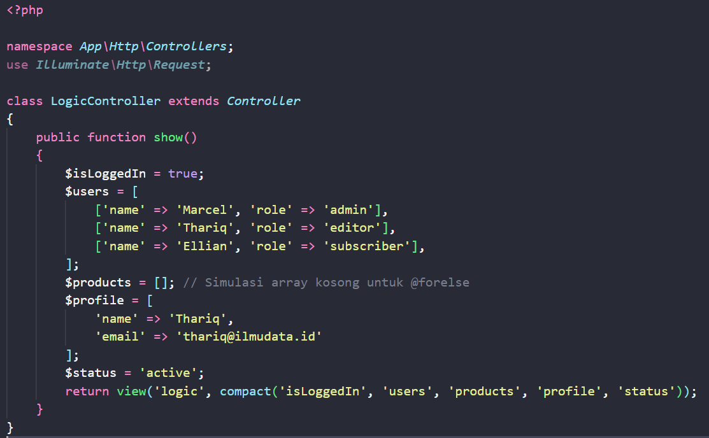

4.  Buat Blade View.
    Buat file view di resources/views/logic.blade.php:
    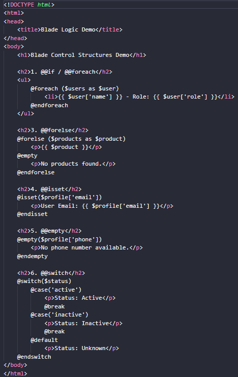
   

5.  Jalankan aplikasi 
    http://127.0.0.1:8000/logic
    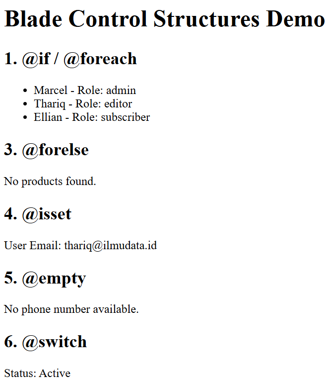
    
---

2.3 Praktikum 3 – Layout dan Personalisasi di Laravel 12 dengan Bootstrap

1. Buat Controller baru dengan perintah : php artisan make:controller PageController. 
    Anda akan menemukan controller baru di app/Http/Controllers/PageController.php.

2. Menambahkan Route
    Buka routes/web.php dan tambahkan rute baru:
    

3. Update Controller
    Di app/Http/Controllers/PageController.php isikan kode berikut:
    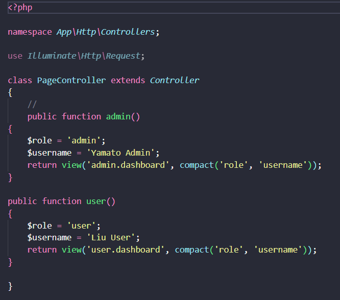

4. Buat Layout Dasar dengan Bootstrap
    Kemudian, buat resources/views/layouts/app.blade.php dan isikan kode berikut:
    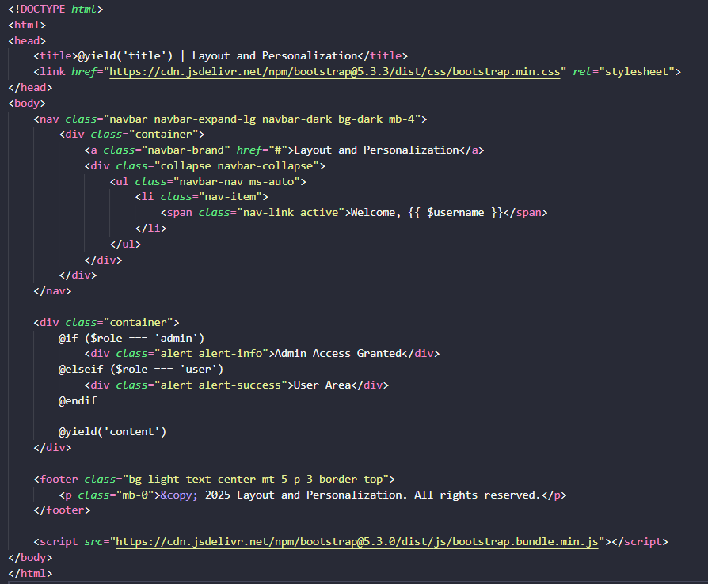
   

5. Buat view untuk Admin
    Buat direktori admin di resources/views jika belum ada. Kemudian, buat resources/views/admin/dashboard.blade.php:
    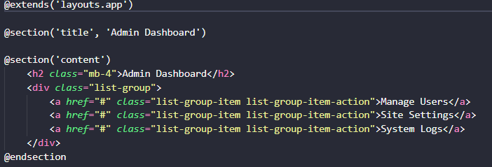

6. Buat view untuk User
    Buat direktori user di resources/views jika belum ada. Kemudian, buat resources/views/user/dashboard.blade.php:
    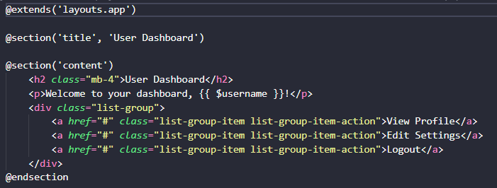

7. Jalankan aplikasi 
    http://127.0.0.1:8000/admin
    Output: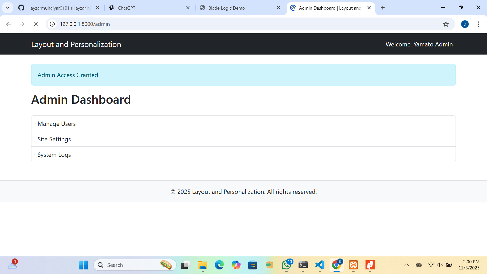
    http://127.0.0.1:8000/user
     Output: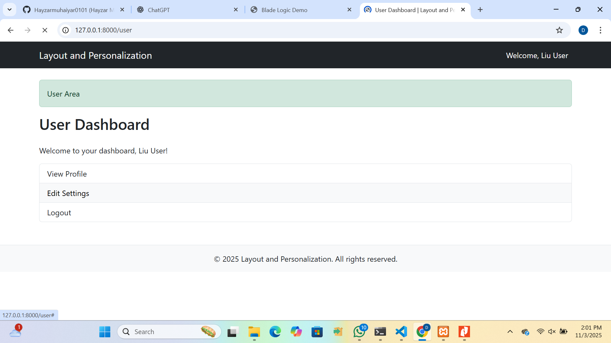

2.4 Praktikum 4 - Partial Views, Blade Components, dan Theme Switching di Laravel 12 

1. Buat proyek laravel dengan perintah Laravel new modul-4-blade-ui, kemudian masuk ke proyek dengan perintah cd modul-4-blade-ui.

2. Buat controller untuk menangani semua rute dan logika: php artisan make:controller UIController. 

3. Buka routes/web.php dan tambahkan:
    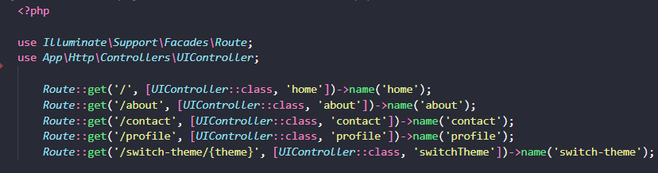

4. Update Controller
    Edit app/Http/Controllers/UIController.php:
    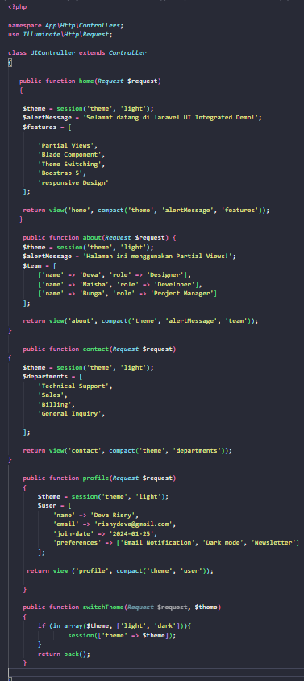

5. Buat Layout Utama dengan Theme Support
    Buat direktori layouts di resources/views jika belum ada. Kemudian buat resources/views/layouts/app.blade.php:
    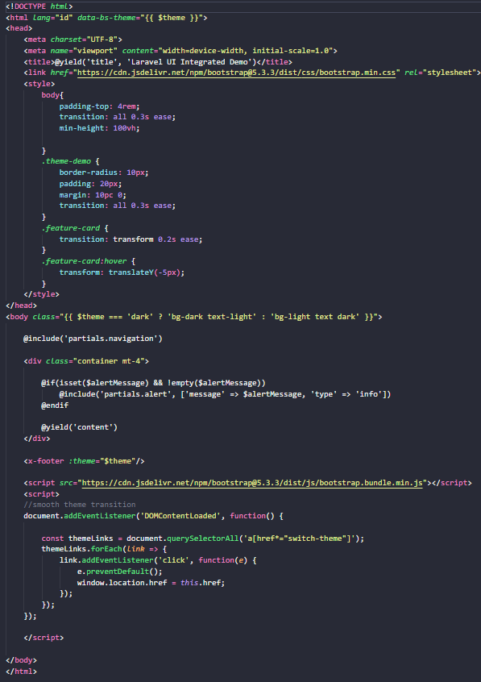

6. Buat Partial Views
    Buat direktori partials di resources/views dan buat file berikut:
    - resources/views/partials/navigation.blade.php:
    
    - Selanjutnya, buatkan sebuah file resources/views/partials/alert.blade.php:
    

7. Buat Blade Components
    php artisan make:component Footer
    php artisan make:component FeatureCard
    php artisan make:component TeamMember
    php artisan make:component ContactForm

- Kemudian, Edit resources/views/components/footer.blade.php:
    

- Kemudian, Edit resources/views/components/feature-card.blade.php:
    

- Selanjutnya, Edit resources/views/components/team-member.blade.php:
    

- Buat Main Views
    Buat view-view utama:
    - resources/views/home.blade.php
    - resources/views/about.blade.php
    - resources/views/partials/team-stats.blade.php
    - resources/views/contact.blade.php
    - resources/views/components/contact-form.blade.php
    - resources/views/profile.blade.php

8. Jalankan dan Test Aplikasi
    - Home: http://127.0.0.1:8000
    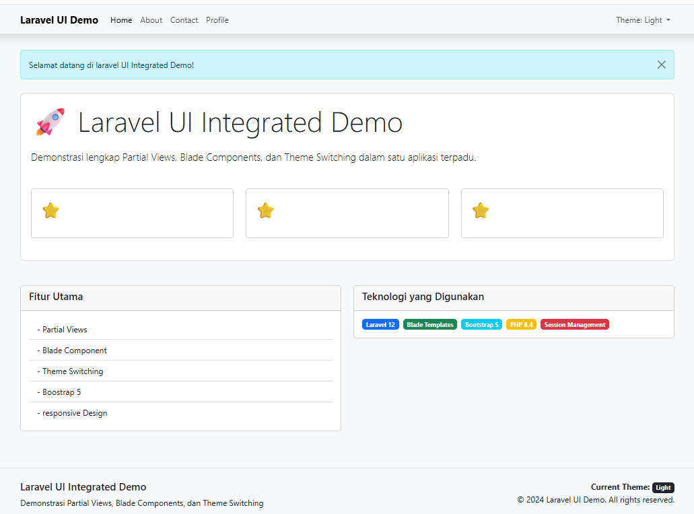

    - About: http://127.0.0.1:8000/about
    

    - Contact: http://127.0.0.1:8000/contact
    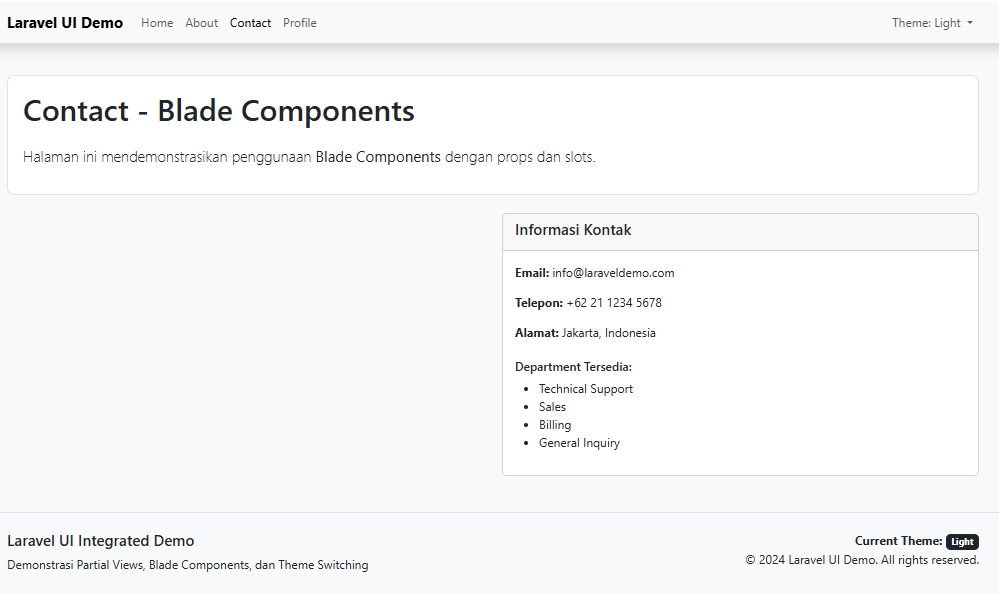

    - Profile: http://127.0.0.1:8000/profile
    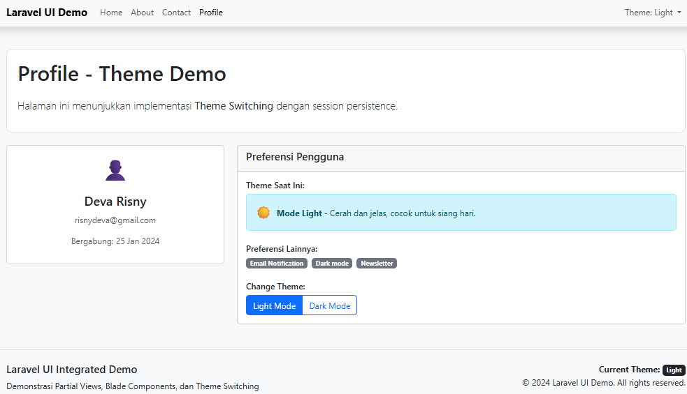

---

## 3. Hasil dan Pembahasan
Berdasarkan hasil dari seluruh rangkaian praktikum:

Praktikum 1: Data berhasil dikirim dari controller ke view dan ditampilkan menggunakan sintaks {{ }} pada file .blade.php.

Praktikum 2: Struktur kontrol Blade seperti @if, @foreach, dan @isset berhasil diterapkan untuk menampilkan data secara dinamis.

Praktikum 3: Layout berbasis Bootstrap berhasil diterapkan, menghasilkan tampilan yang seragam dan responsif di seluruh halaman.

Praktikum 4: Partial views dan blade components berhasil dibuat untuk meningkatkan modularitas, serta theme switching berjalan dengan baik sesuai preferensi pengguna.

Secara keseluruhan, seluruh endpoint aplikasi (/dasar, /logic, /admin, /user, /about, /contact, /profile) berjalan dengan baik. Hal ini menunjukkan bahwa integrasi antara Controller, View, dan Blade Template Engine berfungsi dengan semestinya.

---

## 4. Kesimpulan
Dari hasil praktikum yang telah dilakukan dapat disimpulkan bahwa Controller memiliki peran penting sebagai pengatur logika aplikasi sekaligus penghubung antara Model dan View pada arsitektur MVC. Penggunaan Blade Template Engine membantu proses pembuatan tampilan menjadi lebih dinamis, rapi, dan mudah dikelola.

Selain itu, penerapan layout, partial view, dan component membuat struktur antarmuka web menjadi lebih modular dan efisien dalam pengembangan. Dengan dukungan Bootstrap, tampilan halaman menjadi lebih menarik, responsif, dan konsisten di setiap bagian aplikasi.

Secara keseluruhan, praktikum ini membantu mahasiswa memahami cara kerja dan penerapan konsep MVC pada framework Laravel secara menyeluruh, serta meningkatkan kemampuan dalam mengembangkan aplikasi web yang terstruktur dan mudah dikelola.

---

## 5. Referensi
1. Peran Controller dan View https://www.rumahweb.com/journal/belajar-laravel-bagian-3/
2. Fungsi Layout https://buildwithangga.com/tips/belajar-mengenal-views-pada-framework-laravel-11-sebagai-pemula
3. komponen  https://laravel.com/docs/12.x/blade#components
4. apa itu parsial https://prateeksha.com/blog/in-laravel-how-to-use-partial-template

---